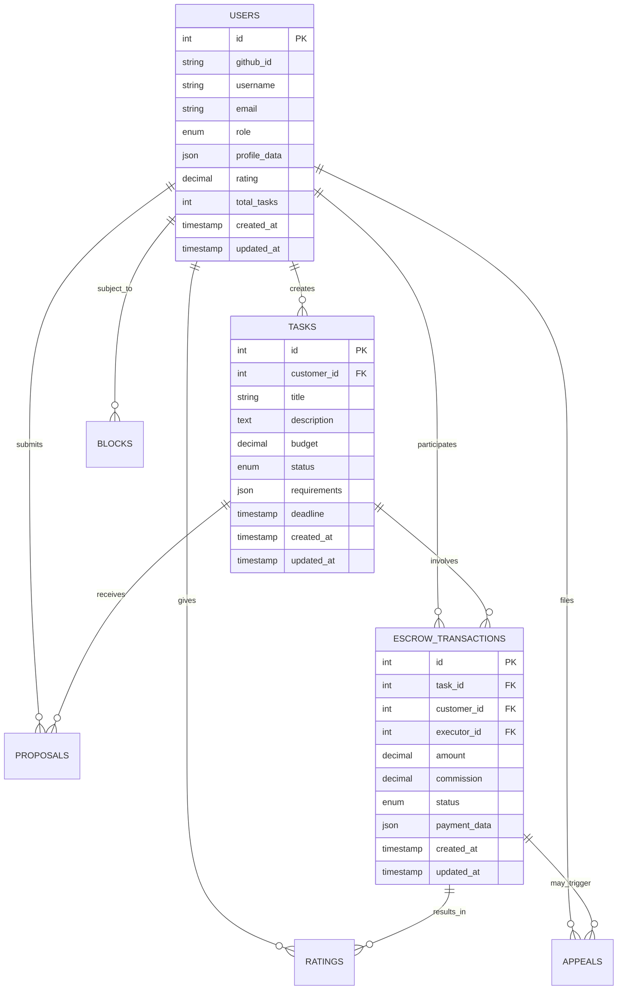

# Техническое задание: B2C Freelance Platform

## 1. Анализ рынка B2C-фриланс платформ

### Сравнительная таблица конкурентов

| Платформа | Комиссия | Особенности | Сильные стороны | Слабые стороны |
|-----------|----------|-------------|-----------------|-----------------|
| **Upwork** | 20% → 10% → 5% | Глобальная платформа, эскроу | Большая база фрилансеров, защита платежей | Высокая комиссия, сложная система |
| **Fiverr** | 20% | Микрозадачи, готовые услуги | Простота использования, низкий порог входа | Ограниченная гибкость, высокая комиссия |
| **TopTal** | 10-20% | Премиум сегмент, строгий отбор | Высокое качество исполнителей | Высокие требования, ограниченный доступ |
| **Kwork** | 20% | Российский рынок, рублевые платежи | Локализация, простота | Ограниченная функциональность |

### Анализ проблем существующих платформ

1. **Высокие комиссии** (20% у большинства платформ)
2. **Сложность для новичков** (многоуровневые системы)
3. **Недостаточная защита** от мошенничества
4. **Отсутствие AI-поддержки** для пользователей
5. **Слабая система рейтингов** и отзывов
6. **Неэффективная система споров**

## 2. Концепция нашей платформы

### Ключевые преимущества

- **Низкие комиссии**: 1% → 0.8% → 0.5% (в зависимости от суммы)
- **GitHub OAuth**: Быстрая регистрация для IT-специалистов
- **AI Support**: Многоуровневая система поддержки
- **Защищенный escrow**: Администраторские кошельки
- **Система блокировок**: Защита от мошенничества
- **Апелляции**: Справедливое разрешение споров

### Целевая аудитория

- **Заказчики**: IT-компании, стартапы, частные предприниматели
- **Исполнители**: Разработчики, дизайнеры, маркетологи, копирайтеры
- **География**: Россия и СНГ (рублевые платежи)

## 3. Функциональные требования

### 3.1 Аутентификация и авторизация

- **GitHub OAuth 2.0** для входа
- **Роли пользователей**: Заказчик, Исполнитель, Модератор, Администратор
- **Верификация профиля** через GitHub
- **Двухфакторная аутентификация** (опционально)

### 3.2 Управление задачами

- **Создание задач** с детальным описанием
- **Категории и теги** для классификации
- **Бюджет и сроки** выполнения
- **Приватные и публичные** задачи
- **Система предложений** от исполнителей

### 3.3 Система escrow

- **Администраторские кошельки** для хранения средств
- **Автоматическое удержание** комиссии
- **Поэтапные выплаты** по согласованию
- **Автоматический возврат** при нарушении сроков
- **Ручное одобрение** при спорах

### 3.4 Система рейтингов и отзывов

- **5-звездочная система** оценки
- **Защита от накрутки** рейтингов
- **Заморозка рейтинга** при подозрении на мошенничество
- **Апелляции** с прикреплением доказательств
- **Влияние рейтинга** на видимость в поиске

### 3.5 AI Support

- **FAQ база** с частыми вопросами
- **AI-чатбот** для первичной поддержки
- **Эскалация к оператору** при сложных вопросах
- **Сбор контекста** из истории задач и транзакций
- **Многоязычная поддержка** (русский, английский)

### 3.6 Система блокировок и апелляций

- **Автоматические блокировки** по подозрительной активности
- **Ручная модерация** спорных случаев
- **Система апелляций** с доказательствами
- **Блокировка по железу** (MAC-адрес, отпечаток браузера)
- **Временные и постоянные** блокировки

## 4. Техническая архитектура

### 4.1 Backend (Node.js + Express)

```
backend/
├── src/
│   ├── controllers/     # Контроллеры API
│   ├── models/         # Модели данных
│   ├── routes/         # Маршруты API
│   ├── middleware/     # Промежуточное ПО
│   ├── services/       # Бизнес-логика
│   ├── utils/          # Утилиты
│   └── config/         # Конфигурация
├── tests/              # Тесты
└── docs/               # API документация
```

### 4.2 Frontend (React + TypeScript)

```
frontend/
├── src/
│   ├── components/     # React компоненты
│   ├── pages/         # Страницы приложения
│   ├── hooks/         # Custom hooks
│   ├── store/         # Состояние (Zustand)
│   ├── services/      # API сервисы
│   ├── utils/         # Утилиты
│   └── types/         # TypeScript типы
├── public/            # Статические файлы
└── tests/             # Тесты
```

### 4.3 База данных (PostgreSQL)

**Основные таблицы:**
- `users` - пользователи
- `tasks` - задачи
- `proposals` - предложения
- `escrow_transactions` - escrow транзакции
- `ratings` - рейтинги и отзывы
- `appeals` - апелляции
- `blocks` - блокировки
- `ai_support_tickets` - тикеты поддержки

## 5. ER-диаграмма базы данных



## 6. API спецификация

### 6.1 Аутентификация

```yaml
POST /api/auth/github
  description: Авторизация через GitHub OAuth
  responses:
    200:
      body:
        token: string
        user: UserProfile

GET /api/auth/me
  description: Получение текущего пользователя
  headers:
    Authorization: Bearer {token}
```

### 6.2 Задачи

```yaml
GET /api/tasks
  description: Получение списка задач
  query:
    category: string
    budget_min: number
    budget_max: number
    status: string

POST /api/tasks
  description: Создание новой задачи
  body:
    title: string
    description: string
    budget: number
    category: string
    deadline: string
```

### 6.3 Escrow

```yaml
POST /api/escrow/fund
  description: Пополнение escrow
  body:
    task_id: number
    amount: number

POST /api/escrow/release
  description: Выплата исполнителю
  body:
    transaction_id: number
    amount: number

POST /api/escrow/refund
  description: Возврат заказчику
  body:
    transaction_id: number
    reason: string
```

## 7. Состояния escrow

```typescript
enum EscrowStatus {
  INIT = 'INIT',                    // Инициализация
  FUNDED = 'FUNDED',               // Средства зачислены
  IN_PROGRESS = 'IN_PROGRESS',     // Работа в процессе
  PENDING_RELEASE = 'PENDING_RELEASE', // Ожидание выплаты
  RELEASED = 'RELEASED',           // Выплачено исполнителю
  REFUNDED = 'REFUNDED',           // Возвращено заказчику
  DISPUTE = 'DISPUTE'              // Спор
}
```

## 8. Система комиссий

### 8.1 Динамические комиссии

```typescript
interface CommissionRate {
  minAmount: number;
  maxAmount: number;
  rate: number; // в процентах
}

const COMMISSION_RATES: CommissionRate[] = [
  { minAmount: 0, maxAmount: 10000, rate: 1.0 },
  { minAmount: 10000, maxAmount: 50000, rate: 0.8 },
  { minAmount: 50000, maxAmount: Infinity, rate: 0.5 }
];
```

### 8.2 Редактирование комиссий

- **Администраторский интерфейс** для изменения ставок
- **Применение в реальном времени** для новых транзакций
- **Логирование изменений** комиссий
- **Уведомления пользователей** об изменениях

## 9. Безопасность

### 9.1 Защита от мошенничества

- **Анализ поведения** пользователей
- **Проверка документов** при больших суммах
- **Система репутации** с весовыми коэффициентами
- **Автоматические блокировки** по подозрительной активности

### 9.2 Техническая безопасность

- **HTTPS** для всех соединений
- **JWT токены** с коротким временем жизни
- **Rate limiting** для API
- **Валидация входных данных**
- **Защита от SQL injection**
- **CSRF защита**

## 10. Масштабирование

### 10.1 Производительность

- **Redis** для кэширования
- **Индексы БД** для быстрого поиска
- **CDN** для статических файлов
- **Горизонтальное масштабирование** API

### 10.2 Мониторинг

- **Sentry** для отслеживания ошибок
- **Prometheus + Grafana** для метрик
- **Логирование** всех операций
- **Алерты** при критических ошибках

## 11. План разработки

### Фаза 1: MVP (2-3 месяца)
- Базовая авторизация
- Создание и просмотр задач
- Простой escrow
- Система рейтингов

### Фаза 2: Расширение (1-2 месяца)
- AI Support
- Система блокировок
- Апелляции
- Улучшенная аналитика

### Фаза 3: Оптимизация (1 месяц)
- Производительность
- Безопасность
- Мониторинг
- Тестирование

## 12. Критерии успеха

- **1000+ зарегистрированных пользователей** в первый месяц
- **100+ активных задач** еженедельно
- **< 5% споров** от общего числа транзакций
- **> 4.5 средний рейтинг** платформы
- **< 2 секунды** время отклика API
- **99.9% uptime** платформы
